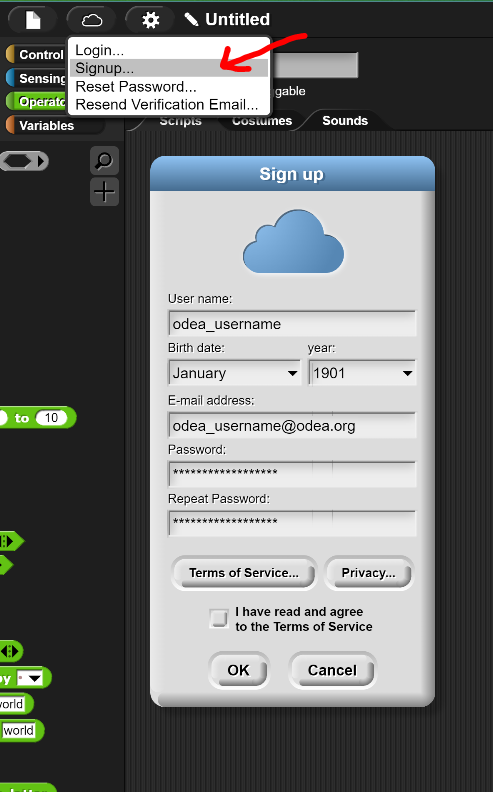
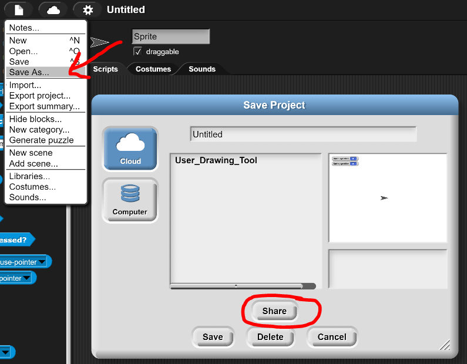
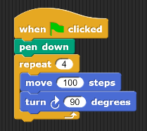
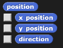
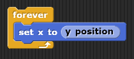
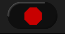
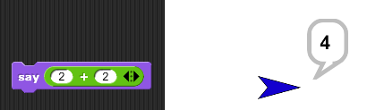
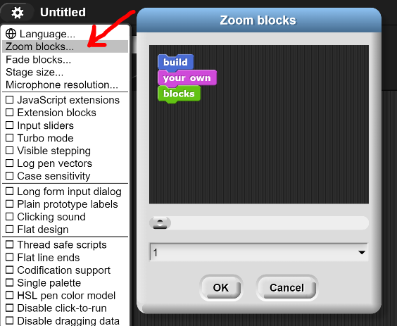

# Introduction to Computer Science - Sept 7th 2023
---
## Section 0 - Create a Snap account!
---
If you have not done so already, create an account with Snap! Use your `odea` emails. (If you already have an account, then just log in for now)

Once you are signed up and logged in, you can `save` your projects to snap, and `share` them as well! We will be using the `share` functionality to turn in assignments! :)

## Section 1 - Reporters
---
First lets start with a quiz! What does the below script do when run?

Discuss with the person sitting next to you!

### Reporters:
In the `Montion` tab, scroll to the bottom of the available blocks, to find the `reporters`.

These are a different kind of block that do not cause action to occur, but instead report values back to the user. Try clicking the checkbox next to the `x position` and `y position` reporters, and you should see that the x and y cartesian coordinates of the turtle are shown in the top left corner of the stage. Try dragging and dropping the turtle and you should see these values change.

But what makes the `reporters` useful? They can be used as inputs! 

## Section 2 - Forever
---
As you have already seen above, the forever block executes the blocks placed within the forever block... forever! This creates what we call an `infinite loop`. This can be pretty useful as you have already seen! 

Once the forever block has started executing, it will not be stopped until the stop sign in the top right is pressed: 

We can also execute the `stop <...>` block to achieve the same effect: 

> #### Excercise 1
> **Individually**, using the `mouse x` and `mouse y` reporters, create a script that allows the user to draw by dragging thier mouse across the stage. When you are done, close your surface. 
> 
> 

## Section 3 - Operators
The last new block we will learn today are `Operators`. These blocks allow you to perform mathmatical operations, and can also be used as input. Take the following example:

These blocks will be useful for your lab today! :)

## Lab 1 - Kaleidoscope!
---
> You will be turning in this lab for credit, so remember to save it, and use the `share` option to provide the URL to us on Teams!

Make a script that create a Kaleidoscope image, akin to the gif below:

One cursor will be following the mouse like we did in the above exercise, and the other cursors will be reflected across the x and y axis. 

**IMPORTANT**: We have not yet taught you how to make multiple turtles. Please first write as much of a script as you can for one turtle, and then create a new one by right-clicking the current turtle, and using the `duplicate` option. This duplicates all of the scripts you've written for the first turtle, saving you time writting the same script again :)

Other tidbits:
- Make the lines of varrying colors, as long as they are not all the same color
- include options to clear the stage, put the pen up and down, and recenter all turtles to (0,0) at the press of seperate keystrokes.

## Extra!
- Make the turtles continusly grow while the scripts are running
- Make the turtles grow in size the further to the left or down they are, and then shrink the further up or right they are

## Helpful bits
- If you can't quite read the words on the blocks, using the `Zoom blocks` tool to help make the block size larger: 
