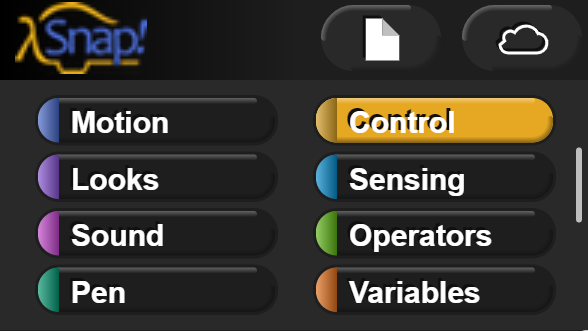
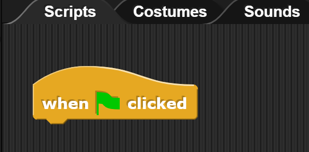
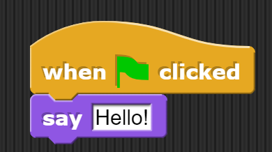
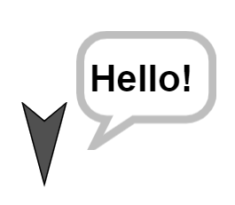
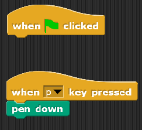

#Introduction to Computer Science - Sept 5th 2023

##Section 1 - Algorithms
What is an algorithm? 

Write out the instructions for how to make a Jelly Sandwhich, step by step.

##Section 2 - Snap Hello World
Open snap [https://snap.berkeley.edu/snap/snap.html](https://snap.berkeley.edu/snap/snap.html).

At the top left of the Snap page:

Select "Control". Then, from the left side of the screen, drag and drop the "When :flag: clicked" block into the `Scripts` tab of the workspace:

Then, once again at the top left, select `Looks`, and drag the `say [Hello!]` block into the `Scripts` workspace. Place it beneath the green flag block so that it "attaches" beneath it. It should look like:

Click the Green flag at the top right of the page to get your turtle (yes, it is called a turtle) to say "Hello!"

##Section 3 - Snap Grid System
Are you already familiar with the cartesian coordinate system?
[link to coordinate tool](https://www.desmos.com/calculator/ui4klsjued)

If you want to confirm your knowledge of the coordiate system, feel free to take this test with a tool that is also built in Snap: [Peabodoy Test](https://snap.berkeley.edu/snap/snap.html#present:Username=aspiece%40gmail.com&ProjectName=PeabodyTest)

The coordinates in the Snap `scenes` run from -240 -> 240 on the x-axis, and -180 -> 180 on the y-axis.

###Lab 1)
Create a program in script that draws a shape with at least 8 points when the green flag is pressed. See below image for an example:

##Extra!
If you finish the class work in this section, but want to challenge yourself, try to complete some of the activites below! ;)

- Get the above lab to work at the press of the `a` key
- Create a program that allows the user to draw their own shape. This can be done with keyboard inputs / mouse clicks of any kind. The program needs to be able to clear the `stage` as well (there is a `clear` block in the `Pen` section). (Hint: you can have multiple seperate triggers for actions)
  
