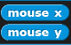
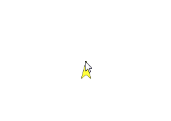

# Introduction to Computer Science - Sept 7th 2023
---
## Section 0 - Create a Snan account!
---
If you have not done so already, create an account with Snap! Use your `odea` emails. (If you already have an account, then just log in for now)

Once you are signed up and logged in, you can `save` your projects to snap, and `share` them as well! We will be using the `share` functionality to turn in assignments! :)

## Section 1 - More kinds of Blocks!
---
First lets start with a quiz! What does the below script do when run?

Discuss with the person sitting next to you!

### Reporters:
In the `Montion` tab, scroll to the bottom of the available blocks, to find the `reporters`.

These are a different kind of block that do not cause action to occur, but instead report values back to the user. Try clicking the checkbox next to the `x position` and `y position` reporters, and you should see that the x and y cartesian coordinates of the turtle are shown in the top left corner of the stage. Try dragging and dropping the turtle and you should see these values change.

But what makes the `reporters` useful? They can be used as inputs! 

> #### Excercise 1
> **Individually**, using the `mouse x` and `mouse y` reporters, create a script that allows the user to draw by dragging thier mouse across the stage. When you are done, close your surface. 
> 
> 

### Lab 1 - Kaleidoscope!
---
> You will be turning in this lab for credit, so remember to save it, and use the `share` option to provide the URL to us on Teams!

Make a script that create a Kaleidoscope image, akin to the gif below:

One cursor will be following the mouse like we did in the above exercise, and the other cursors will be reflected across the x and y axis.

## Extra!

## Helpful bits
- If you can't quite read the words on the blocks, using the `Zoom blocks` tool to help make the block size larger: 
- The forever blocks will run until the stop sign in the top right is pressed. This stop sign is equivalent to the `stop <...>` block: 
