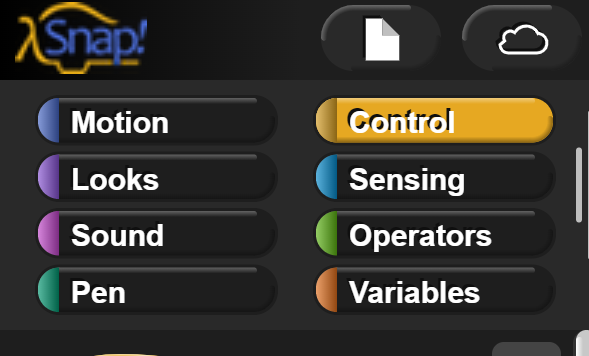

Introduction to Computer Science - Sept 5th 2023
===============================

Section 1 - Algorithms
---------
What is an algorithm? 

Write out the instructions for how to make a Jelly Sandwhich, step by step.

Section 2 - Snap Hello World
---------
Open snap [https://snap.berkeley.edu/snap/snap.html](https://snap.berkeley.edu/snap/snap.html).

At the top left of the Snap page:

Section 3 - Snap Grid System
---------

