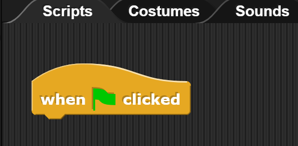

Introduction to Computer Science - Sept 5th 2023
===============================

Section 1 - Algorithms
---------
What is an algorithm? 

Write out the instructions for how to make a Jelly Sandwhich, step by step.

Section 2 - Snap Hello World
---------
Open snap [https://snap.berkeley.edu/snap/snap.html](https://snap.berkeley.edu/snap/snap.html).

At the top left of the Snap page:

Select "Control". Then, from the left side of the screen, drag and drop the "When :black_flag: clicked" into the `Scripts` tab of the workspace:

Section 3 - Snap Grid System
---------

Extra!
------
If you finish the class work in this section, but want to challenge yourself, try to complete some of the activites below! :wink:

- Get the above lab to work at the press of the `a` key

